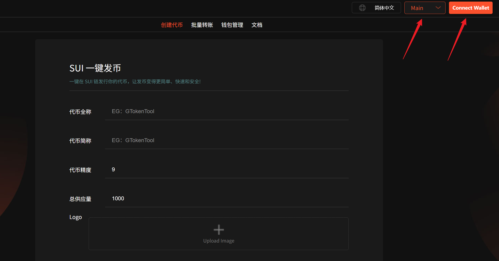
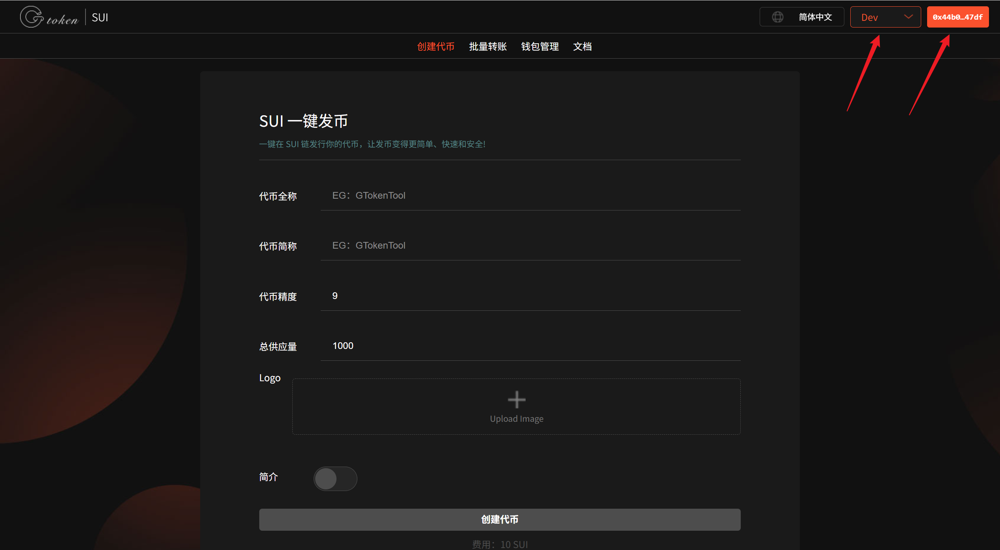
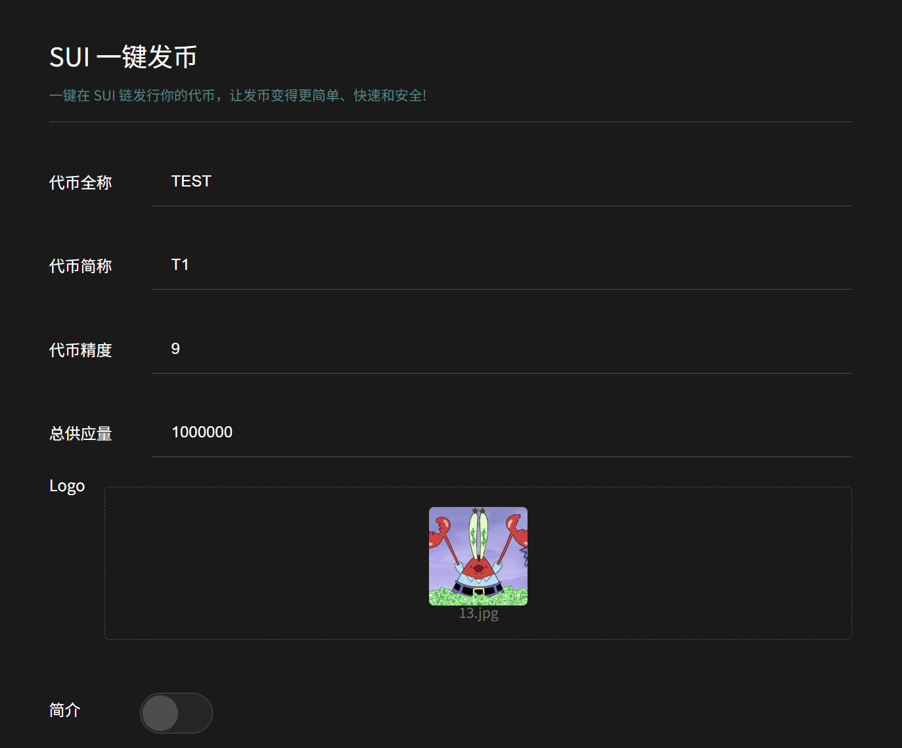
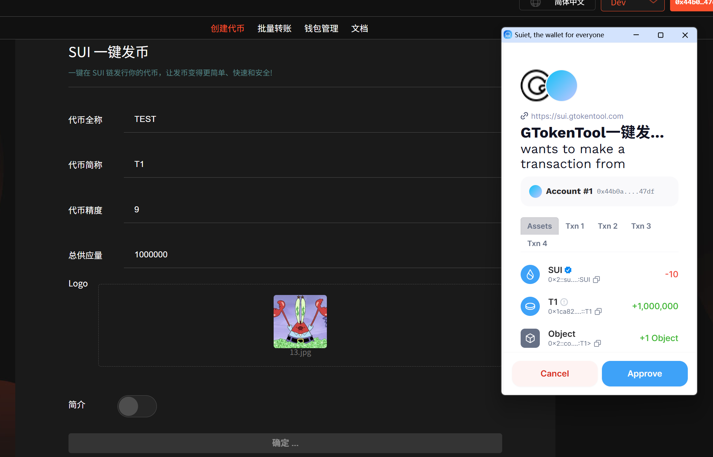
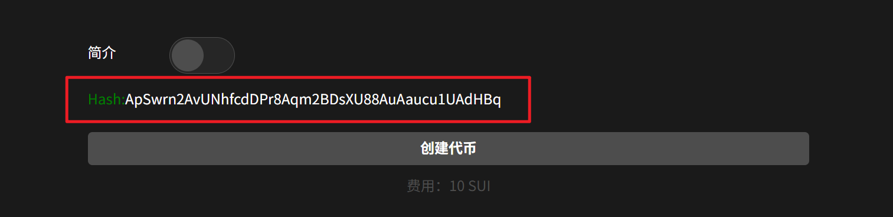
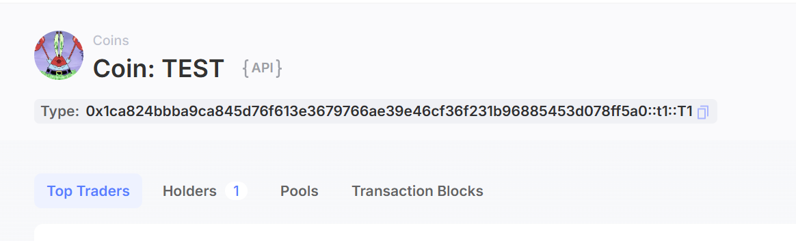

# 🔥 Sui链代币创建教程

Sui代币作为Sui Network的原生加密货币，在网络生态系统中发挥着举足轻重的作用。Sui于2023年5月3日与Sui主网同步上线，迅速获得市场关注。基于这个因素，GtokenTool开发了Sui链发币工具，实现无代码开发Sui链MEME币，让任何人都能尽快参与到Sui的生态中。

## 准备事项

1. 安装好Suiet钱包或者SuiWallet插件：[Suiet钱包安装](suiet-qian-bao-an-zhuang-jiao-cheng.md)、[Suiwallet钱包安装](sui-wallet-qian-bao-an-zhuang-shi-yong-jiao-cheng.md)
2. 如果没有安装这两个钱包，欧易Web3钱包也是支持的
3. 钱包内最少准备11个SUI，如果数量不够，会导致发币失败
4. 手机发币建议使用欧易Web3钱包，不要用TP钱包，TP不能传logo

## Sui链发币流程

### 1、连接Sui钱包

创建代币：[https://sui.gtokentool.com/zh-CN/Token/createToken](https://sui.gtokentool.com/zh-CN/Token/createToken)

进入创建代币页面，右上角选择 Main 网络并连接钱包，建议使用 Suiet 钱包。

<figure><figcaption></figcaption></figure>

连接成功后，右上角会显示你的钱包地址，如下图所示：

<figure><figcaption></figcaption></figure>

### 2、输入代币参数

相比较 Solana 来说，Sui的代币参数比较简单，但是要求比较多，有以下几项：

* 代币全称：不支持中文或符号，最多32个字符。
* 代币简称：不支持中文或符号，需要2\~8个字符。
* 代币精度：默认填9，精度与你能填写的最大供应量有关。
* 总供应量：当精度为9时，供应量最大不能超过100亿。当精度为8时，不能超过1000亿，以此类推。
* logo：图片小于100k，尺寸建议256x256像素（正方形）。
* 简介：选填，且不支持中文。

<figure><figcaption></figcaption></figure>

### 3、点击“创建代币”

确定好信息无误之后，点击“`创建代币`”按钮，这时候会跳出 Suiet 钱包，我们确认授权，并支付费用，如下图所示：

<figure><figcaption></figcaption></figure>

当页面出现代币合约地址哈希值的时候，就是告诉你代币已经发布完成了。

<figure><figcaption></figcaption></figure>

点击哈希值就可以在[Sui浏览器](https://suiscan.xyz/)查看到交易信息，也可以去查看代币信息。

<figure><figcaption></figcaption></figure>

<figure><figcaption></figcaption></figure>

此时我们打开自己的 Suiet 钱包或者 Suiwallet，应该也可以看到代币的 Logo。

至此，整个 Sui 链发币工作就算是完成了。

## **常见问题解答**

### **1. 代币部署后如何验证？**

使用 Sui Explorer（如 [Suiscan](https://suiscan.xyz/)）查询交易哈希或模块地址。

通过命令行工具 `sui client object <ID>` 查看代币元数据。

### **2. 为什么无法转账代币？**

可能原因：

* 未正确导入代币模块（需在接收方钱包注册代币类型）。
* Gas 不足或权限错误（如未授权 `public_transfer`）。

### **3. 如何限制代币增发？**

将 `TreasuryCap` 存储在安全模块中，仅允许特定地址调用 `mint` 函数。

### **4. Sui 代币与 EVM 链（如以太坊）有何不同？**

Sui 代币是原生对象，无需预编译合约，但需遵循 Move 的安全模式（如显式权限控制）。

GTokenTool社群:

Telegram：[**https://t.me/gtokentool**](https://t.me/gtokentool)

Twitter:  [**https://x.com/gtokentool**](https://x.com/gtokentool)

Gitbook：[**https://docs.gtokentool.com/**](https://docs.gtokentool.com/)

Github：[**https://github.com/Gtokentool/docs/blob/master/SUMMARY.md**](https://github.com/Gtokentool/docs/blob/master/SUMMARY.md)

YouTube：[**https://www.youtube.com/@GTokenTool**](https://www.youtube.com/@GTokenTool)\
\
\
&#xNAN;_<mark style="color:purple;background-color:orange;">GTokenTool保留随时全权酌情因任何理由修改、变更或取消此公告的权利，无需事先通知。以上信息内容仅供参考，GTokenTool对本平台上的任何虚拟资产、产品或促销活动不做任何推荐或保证。虚拟资产的价格波动很大，投资交易虚拟资产将面临巨大风险。请谨慎投资。</mark>_
