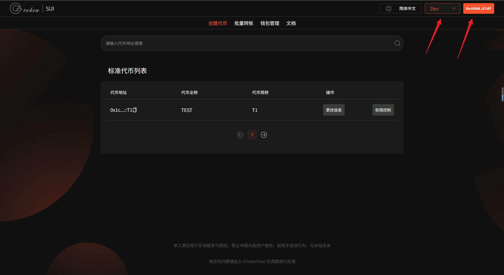

# Sui链更新代币信息教程

## 准备事项

1. 安装好Suiet钱包或者SuiWallet插件：[Suiet钱包安装](suiet-installation.md)、[Suiwallet钱包安装](sui-wallet-installation.md)
2. 如果没有安装这两个钱包，欧易Web3钱包也是支持的
3. 钱包内最少准备6个SUI，如果数量不够，会导致发币失败
4. 手机发币建议使用欧易Web3钱包，不要用TP钱包，TP不能传logo

## 更新代币信息流程

### 1. 连接钱包

管理代币：[https://sui.gtokentool.com/zh-CN/Token/management](https://sui.gtokentool.com/zh-CN/Token/management)

进入管理代币信息页面，右上角选择 Main 网络并连接钱包，建议使用 Suiet 钱包。这里使用测试网演示。

<figure><figcaption></figcaption></figure>

### 2. 点击代币列表里的“更新信息”

随便选择一个代币点击“`更新信息`”，进入更新信息页面。

<figure><figcaption></figcaption></figure>

<figure><figcaption></figcaption></figure>

### 3. 选择代币

选择需要更新代币信息的代币，若没有加载出来，请点击“`重新加载代币`”。

选择代币后会显示当前的代币信息。

<figure><figcaption></figcaption></figure>

### 4. 更改信息

<figure><figcaption></figcaption></figure>

### 5. 点击“确认”，开始交易

<figure><figcaption></figcaption></figure>

弹出钱包后，点击“`Approve`”。交易成功会有提示，下方会显示哈希值，点击可以查看交易情况。

<figure><figcaption></figcaption></figure>

GTokenTool社群:

Telegram：[**https://t.me/gtokentool**](https://t.me/gtokentool)

Twitter:  [**https://x.com/gtokentool**](https://x.com/gtokentool)

Gitbook：[**https://docs.gtokentool.com/**](https://docs.gtokentool.com/)

Github：[**https://github.com/Gtokentool/docs/blob/master/SUMMARY.md**](https://github.com/Gtokentool/docs/blob/master/SUMMARY.md)

YouTube：[**https://www.youtube.com/@GTokenTool**](https://www.youtube.com/@GTokenTool)\
\
\
&#xNAN;_<mark style="color:purple;background-color:orange;">GTokenTool保留随时全权酌情因任何理由修改、变更或取消此公告的权利，无需事先通知。以上信息内容仅供参考，GTokenTool对本平台上的任何虚拟资产、产品或促销活动不做任何推荐或保证。虚拟资产的价格波动很大，投资交易虚拟资产将面临巨大风险。请谨慎投资。</mark>_
