# X Layer代币开源验证教程

很多人在GTokenTool创建了代币后不知道怎么开源，今天这个教程，就是教大家为X Layer（OK链）代币进行开源验证。

## **什么是开源？** 

所谓开源，就是将代币合约代码完完整整的展示出来，让任何人都可以通过区块链浏览器看到你的代币代码，这样代码里有没有后门就一目了然了，开源的目的也是为了让用户放心，

## **开源步骤** 

### **1、进入管理代币页面**

首先，我们需要先进入管理代币页面：[https://www.gtokentool.com/managetokens?chainId=196](https://www.gtokentool.com/managetokens?chainId=196)

进入页面后，选择X layer链并连接钱包。

<figure>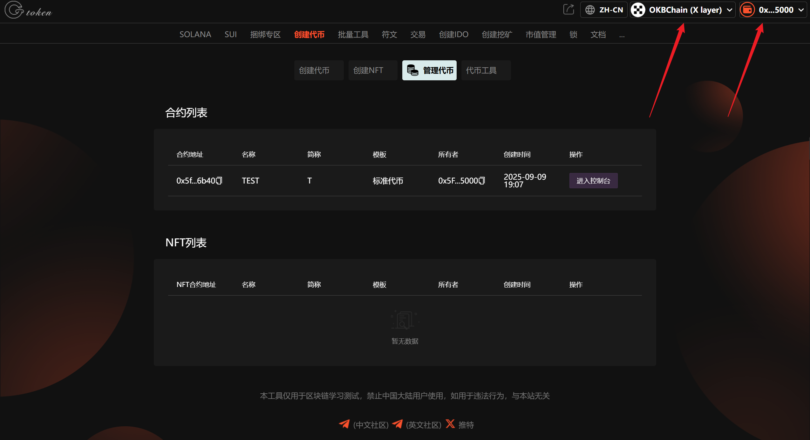<figcaption></figcaption></figure>

### **2、选择代币进入控制台**

<figure>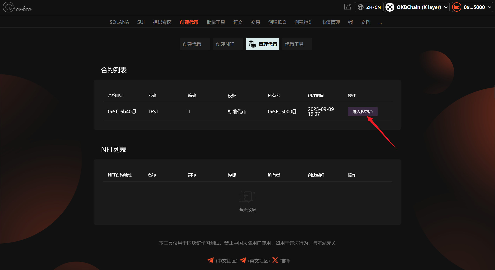<figcaption></figcaption></figure>

### **3、点击“进入区块浏览器”**

<figure>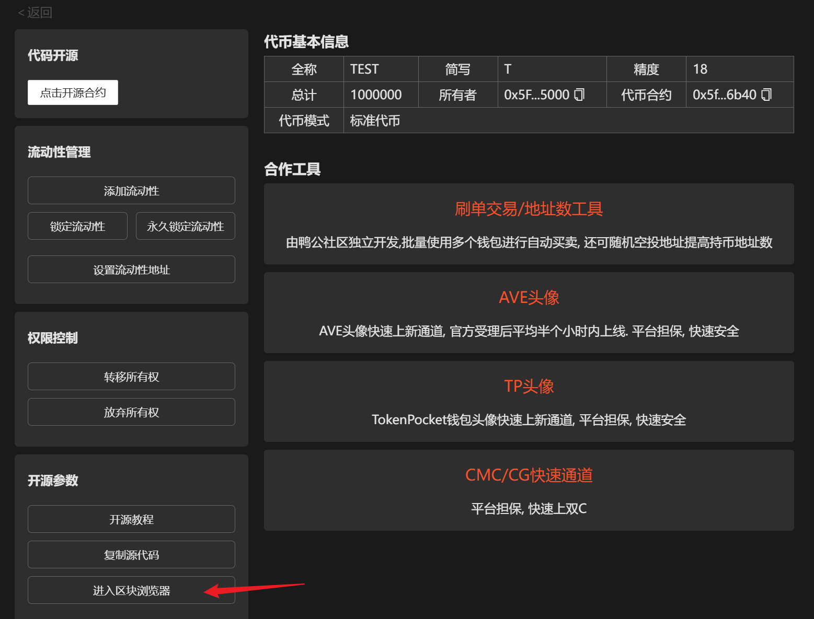<figcaption></figcaption></figure>

### **4、点击“合约”**

<figure>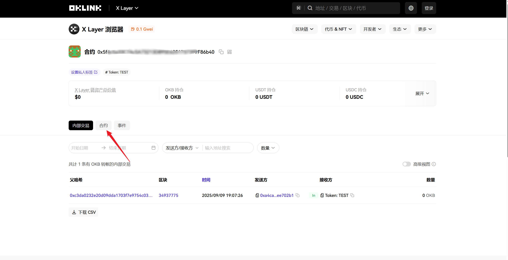<figcaption></figcaption></figure>

### **5、点击“去验证合约”**

<figure>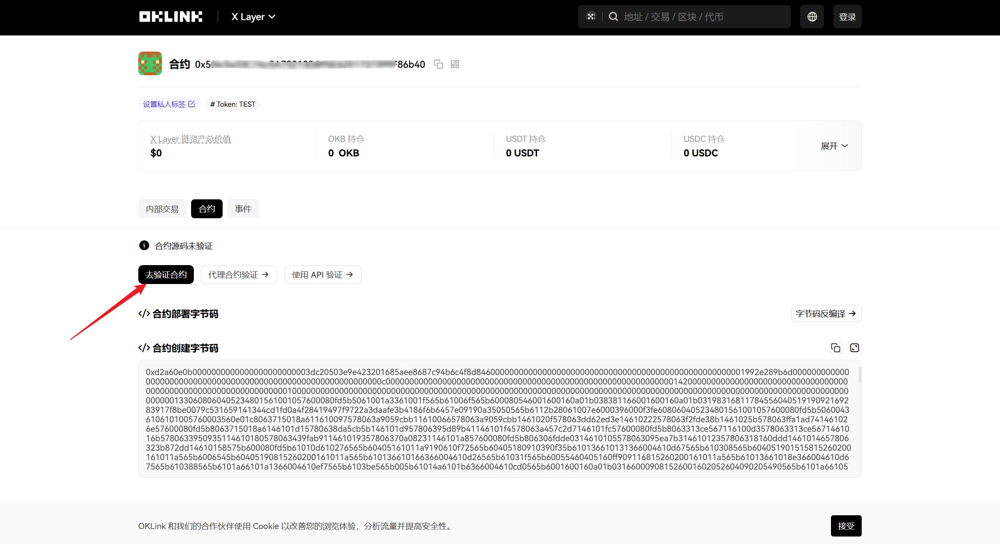<figcaption></figcaption></figure>

### 6. 填写对应参数

合约地址：输入代币合约地址。

编译器类型：Solidity(SingleFile)

编译器版本：v0.8.6+commit.11564f7e

填写好后，点击“下一步”。

<figure>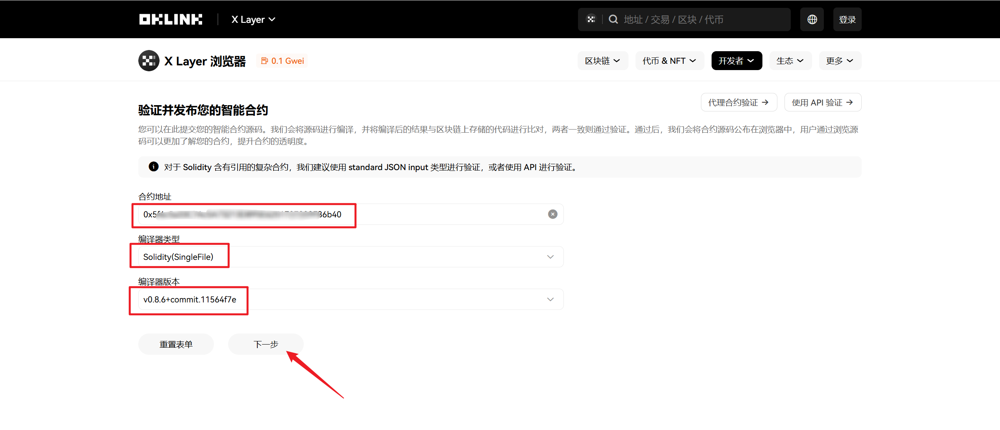<figcaption></figcaption></figure>

### 7. 选择对应参数

<figure>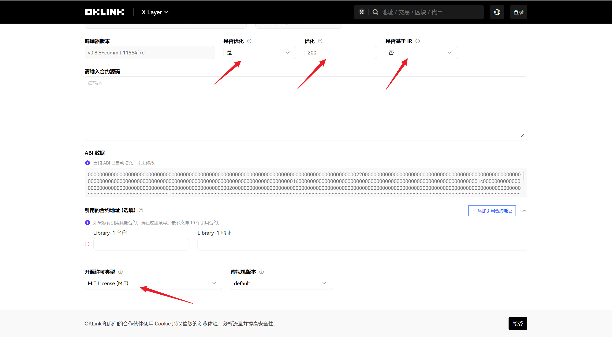<figcaption></figcaption></figure>

### 8. 复制源码

回到控制台页面，点击“复制源代码”。

<figure>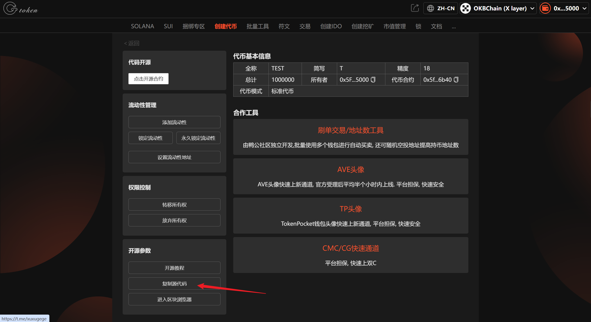<figcaption></figcaption></figure>

复制好后，粘贴到开源页面。

<figure>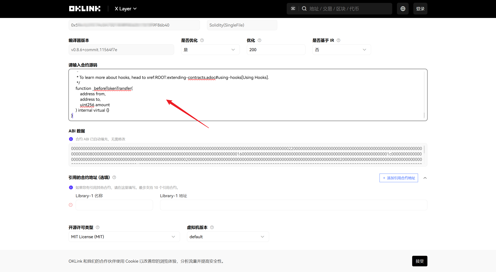<figcaption></figcaption></figure>

### 9. 点击“提交”

<figure>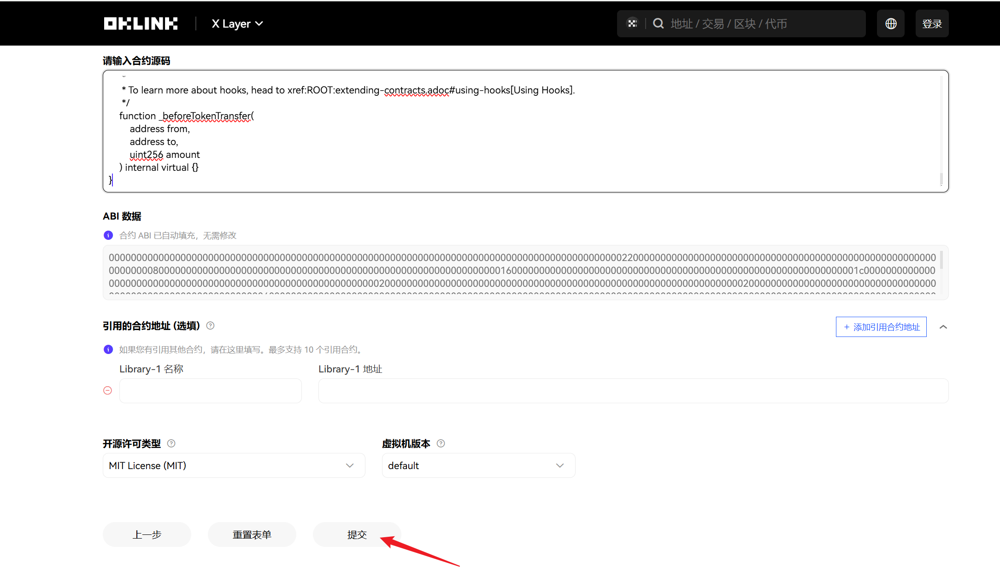<figcaption></figcaption></figure>

等待一会就开源成功了。

<figure>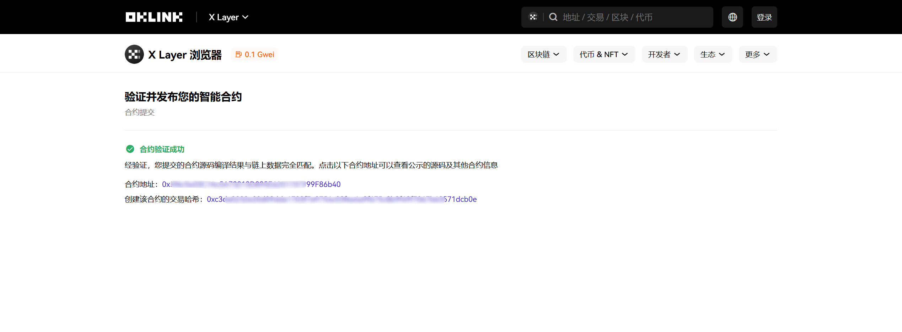<figcaption></figcaption></figure>

点击合约地址，然后点击“合约”，可以看到合约已开源。

<figure>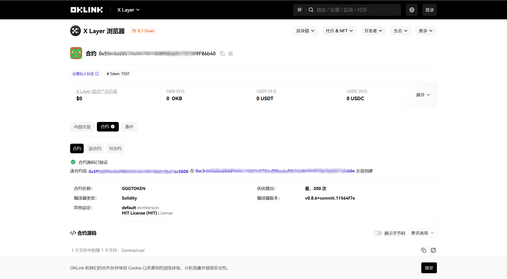<figcaption></figcaption></figure>

[_**GTokenTool | 创建代币、批量空投和做市机器人等Solana工具集**_](https://sol.gtokentool.com)

**安全、开源，给Solana用户带来最便利的一站式体验。**

GTokenTool社群:

Telegram：[**https://t.me/gtokentool**](https://t.me/gtokentool)

Twitter:  [**https://x.com/gtokentool**](https://x.com/gtokentool)

Gitbook：[**https://docs.gtokentool.com/**](https://docs.gtokentool.com/)

Github：[**https://github.com/Gtokentool/docs/blob/master/SUMMARY.md**](https://github.com/Gtokentool/docs/blob/master/SUMMARY.md)

YouTube：[**https://www.youtube.com/@GTokenTool**](https://www.youtube.com/@GTokenTool)\
\
\
<mark style="color:purple;background-color:orange;">**GTokenTool**</mark>_<mark style="color:purple;background-color:orange;">保留随时全权酌情因任何理由修改、变更或取消此公告的权利，无需事先通知。以上信息内容仅供参考，GTokenTool对本平台上的任何虚拟资产、产品或促销活动不做任何推荐或保证。虚拟资产的价格波动很大，投资交易虚拟资产将面临巨大风险。请谨慎投资。</mark>_
