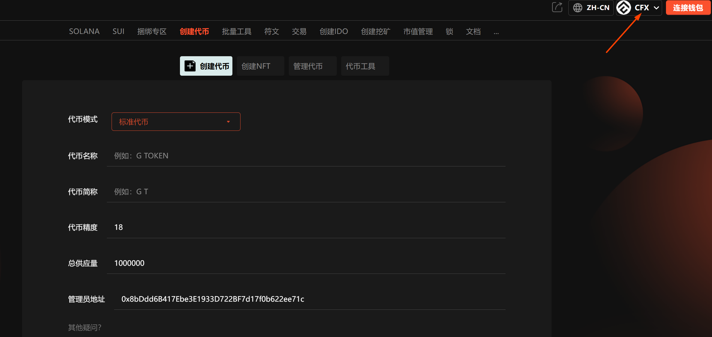

# CFX一键发币教程

### 什么是CFX？ 

CFX 链通常指的是 Conflux Network 的主网，其原生代币称为 CFX。它是一个高性能、可扩展的公有区块链平台，以其独特的树图（Tree-Graph）共识算法而闻名。

<figure><figcaption></figcaption></figure>

### CFX一键发币流程 

#### **(1) 连接钱包** 

进入[GTokenTool](https://www.gtokentool.com/tokenfactory)，点击右上角选择，CFX链。

<figure><figcaption></figcaption></figure>

点击连接钱包，选择小狐狸钱包。

<figure><figcaption></figcaption></figure>

连接成功后，就可以看到钱包地址。

<figure><figcaption></figcaption></figure>

#### **(2) 填写您的**CFX**代币信息** 

点击下面的链接进入CFX发币工具界面。

发币工具：[https://www.gtokentool.com/tokenfactory](https://www.gtokentool.com/tokenfactory)

<figure><figcaption></figcaption></figure>

依次填写代币信息，假设我们创建一个代币叫——“GTokenTool”，填写如下：

<figure><figcaption></figcaption></figure>

* 代币全称：GTokenTool
* 代币简称：G T
* 代币精度：18（小数点后的位数）
* 总供应量：1000000（代币数量）

#### **(3) 完成CFX发币流程** 

点击 “确认创建” ，在小狐狸钱包支付gas费，就完成了。

（注：因为每个用户网络速度不同，支付gas费用时可能会延迟1、2秒，属正常现象。）

<figure><figcaption></figcaption></figure>

以上就是关于CFX发币的整个流程。

如有不明白或者不清楚的地方，请加入官方电报群：[https://t.me/gtokentool](https://t.me/gtokentool)
