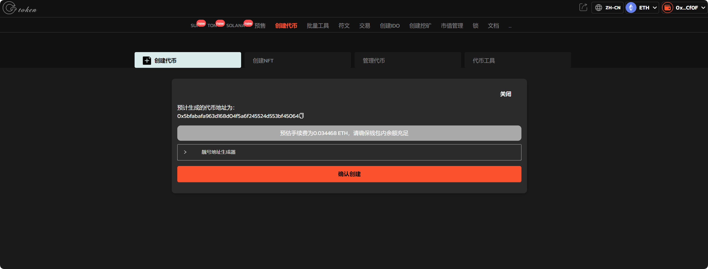

# ERC20一键发币教程

## 1、介绍 

‌ERC20是基于以太坊的代币标准‌。ERC20全称为Ethereum Request for Comments 20，是由以太坊开发者Fabian Vogelsteller于2015年11月提出的。它定义了一套规则，规定了代币如何创建、转移和交互，确保不同平台和应用程序之间的兼容性。

## 2、ERC20一键发币流程 

提示：请先安装小狐狸钱包插件，教程：[https://docs.gtokentool.com/fu-zhu-xin-xi/metamask-installation](https://docs.gtokentool.com/fu-zhu-xin-xi/metamask-installation)

### **(1) 连接钱包**

进入[GTokenTool](https://www.gtokentool.com)，点击右上角选择，ETH链。

<figure><figcaption></figcaption></figure>

<figure><figcaption></figcaption></figure>

点击连接钱包，选择小狐狸钱包。

<figure><figcaption></figcaption></figure>

连接成功后，就可以看到钱包地址。

<figure><figcaption></figcaption></figure>

### **(2) 填写您的代币信息**

点击下面的链接进入ERC20发币工具界面。

发币工具：[https://www.gtokentool.com/tokenfactory](https://www.gtokentool.com/tokenfactory)

<figure><figcaption></figcaption></figure>

依次填写代币信息，假设我们创建一个代币叫——“GTokenTool”，填写如下：

<figure><figcaption></figcaption></figure>

* 代币全称：GTokenTool
* 代币简称：G T
* 代币精度：18（小数点后的位数）
* 总供应量：1000000（代币数量）

填写选项内容

* 官网
* 电报
* 推特

<figure><figcaption></figcaption></figure>

### **(3) 完成ERC20发币流程**

点击 “确认创建” ，在小狐狸钱包支付gas费，就完成了。

（注：因为每个用户网络速度不同，支付gas费用时可能会延迟1、2秒，属正常现象。）

<figure><figcaption></figcaption></figure>

以上就是关于ERC20发币的整个流程。

## 常见问题

### 1. 什么是以太坊区块链以及什么是 ERC20 代币？

以太坊区块链是一个去中心化网络（又称去中心化账本），它允许通过所谓的智能合约创建和执行资产代币。另一方面，ERC20 代币是建立在以太坊区块链之上的一种代币。这些代币遵循智能合约标准（例如 ERC20 或 ERC721），因此可以轻松地在几乎所有兼容以太坊的钱包中创建、管理和保存它们。

### 2. 如何使用代币生成器创建 ERC20 代币？

创建 ERC20 代币通常需要智能合约编程，以及Metamask等 web3 钱包，以及足够的资金来支付代币创建费用。使用代币生成器可以使生成 ERC20 代币的过程变得更容易、更快捷。

GTokenTool 是一款代币生成器，只需定义各种参数即可轻松创建代币：名称、符号、总供应量和其他可自定义功能。这就像填写表格一样简单，然后代币生成器会为您生成智能合约代码。智能合约会自动部署到以太坊区块链上，以成功发行您的数字资产。

如有不明白或者不清楚的地方，请加入官方电报群：[https://t.me/gtokentool](https://t.me/gtokentool)
