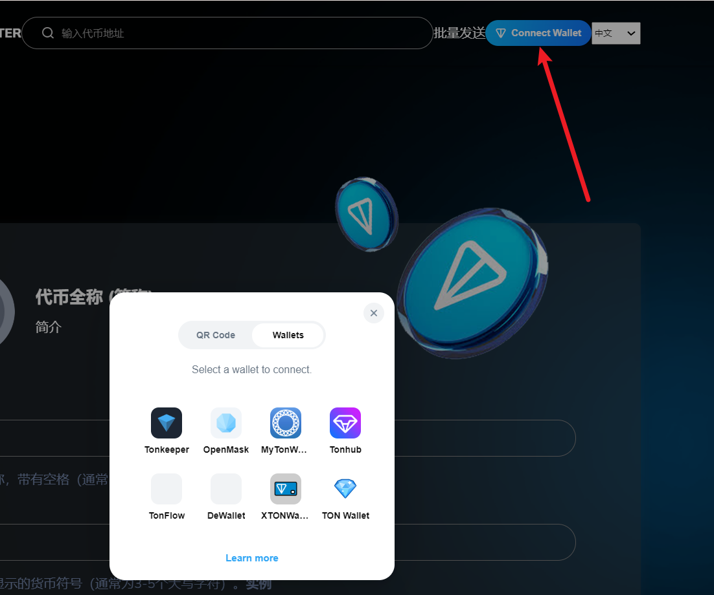
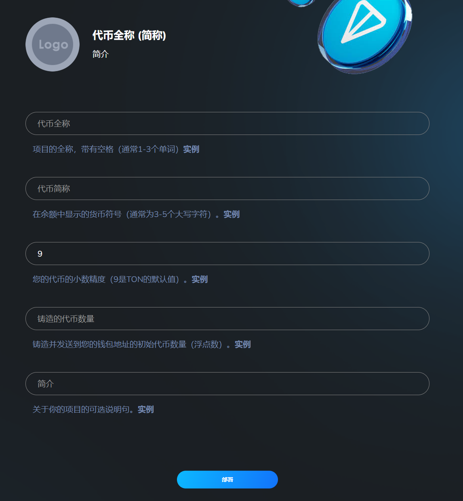
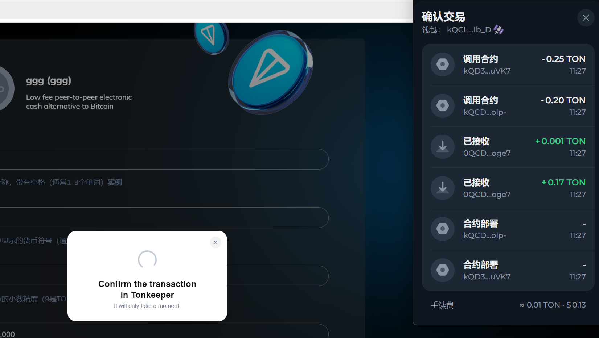

# 3️⃣ Ton链一键发币教程

**Ton 一键发币工具**是专为项目方及开发者打造的高效资产发行利器，旨在助力用户在 Ton 链上极速创建个性化代币。该工具凭借**零代码门槛、极速链上确认及高度安全合规**等特点，支持自定义代币参数并一键部署合约。它是寻求低成本、高效率接入 Ton 生态的项目团队与 Web3 初创者的理想首选方案。

## 📌功能核心摘要：Ton 一键发币

* **功能定位：Ton 生态极速资产发行专家。**&#x4F5C;为专为项目方及开发者量身定制的高效工具，它是低成本、高效率接入 Ton 生态并构建 Web3 资产的首选入口。
* **主要用途：**&#x52A9;力用户在 Ton 链上极速创建个性化代币，支持自定义参数并实现合约的一键部署，全面简化发币流程。
* **核心优势：**
  * **零代码门槛：**&#x65E0;需任何编程基础，即可通过图形化界面完成复杂的代币合约部署。
  * **极速链上确认：**&#x4F9D;托 Ton 链的高性能架构，实现代币铸造与发布的秒级响应。
  * **高度安全合规：**&#x91C7;用标准化的安全合约代码，确保资产发行的严谨性与安全性。
* **适用群体：**&#x5BFB;求快速上链的项目团队、Web3 初创者及需要发行代币进行生态实验的开发者。

***

## 📺Ton一键发币视频教程



## Ton一键发币具体流程

### 1.点击连接钱包

发币官网 [https://ton.gtokentool.com](https://ton.gtokentool.com)

<figure><figcaption>
连接钱包
</figcaption></figure>

### 2.填写代币信息

**Logo：**&#x4EE3;币头像，可在钱包中显示logo代币图片。

**代币名称：**&#x4EE3;币的名称信息（如gggToken），支持英文、中文以及中英文混合，最多15个字符。

**代币简称：**&#x4EE3;币的简称信息（如GGG），支持英文、中文以及中英文混合，最多15个字符。

**代币精度：**&#x4EE3;币的精度位数，默认为9，精度与你能填写的最大总供应量有关。

**总供应量：**&#x4EE3;币的总供应量，当精度为9时，总供应量不能超过100亿；当精度为8时，总供应量不能超过1000亿，以此类推。

**简介：**&#x4EE3;币的简介。

<figure><figcaption>
填写代币信息
</figcaption></figure>

### 3.点击"部署"，创建代币

确认信息之后，点击"`确认创建`"按钮，之后会跳出钱包提示，点击去"`确认`"支付费用，即可完成创建。

<figure><figcaption>
钱包确认交易
</figcaption></figure>

## ❓常见问答 FAQ

### Q: 错误提示503是什么意思？

**A:** 这个提示是网络链接太卡，刷新。

### Q: 为什么我在Tonkeeper钱包里没有看到代币选项？

**A:** 请先确认自己的地址是否正确。TON地址与比特币类似，有个多个，需要切换到正确的活动地址。

### Q: 发币钱包需要准备多个TON？

**A:** 钱包内最少准备5个TON。

### 🤝 连接 GTokenTool 

* **💬 Telegram社群**：[点击加入官方群组](https://t.me/gtokentool)
* **🐦 Twitter (X)**：[关注我们获取最新动态](https://x.com/gtokentool)
* **📚 官方文档**：[查看 Gitbook 文档](https://docs.gtokentool.com/)
* **💻 开源代码**：[访问 GitHub 仓库](https://github.com/Gtokentool/docs/blob/master/SUMMARY.md)
* **📺 视频教程**：[订阅 YouTube 频道](https://www.youtube.com/@GTokenTool)

> ⚠️ 风险提示与免责声明
>
> GTokenTool 保留随时全权酌情因任何理由修改、变更或取消此公告的权利，无需事先通知。
>
> 以上信息内容仅供参考，GTokenTool 对本平台上的任何虚拟资产、产品或促销活动不做任何推荐或保证。虚拟资产的价格波动很大，投资交易虚拟资产将面临巨大风险。**请谨慎投资。**
