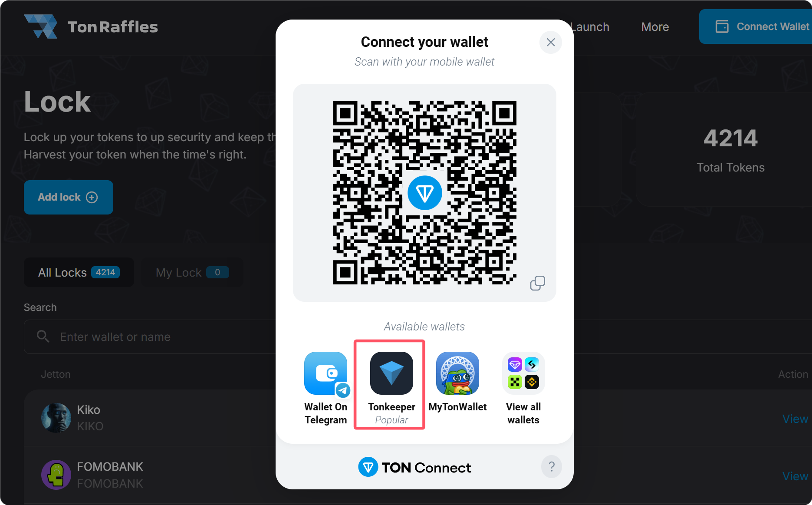
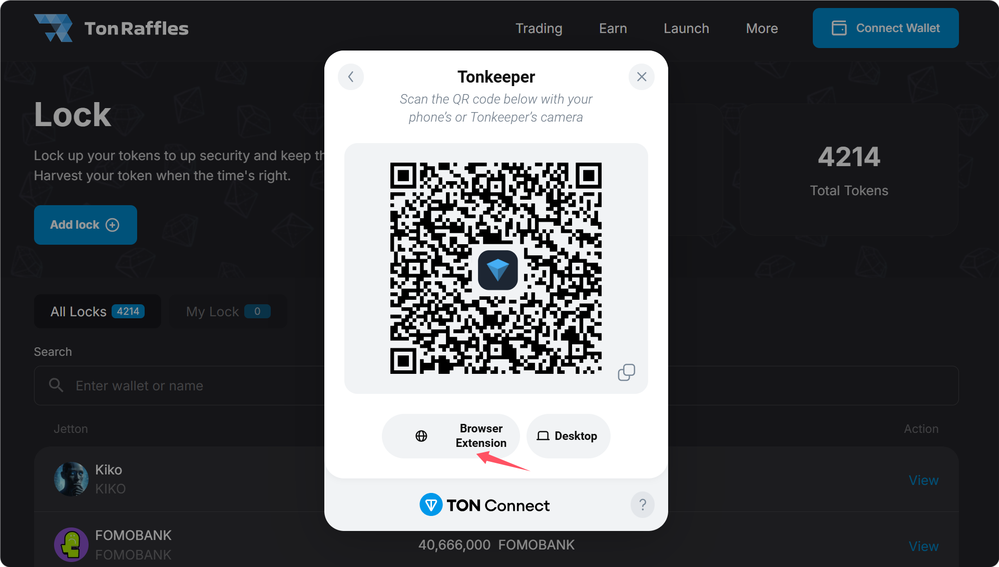
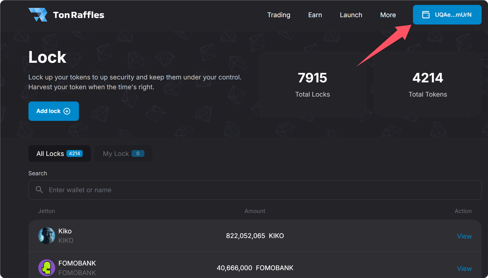
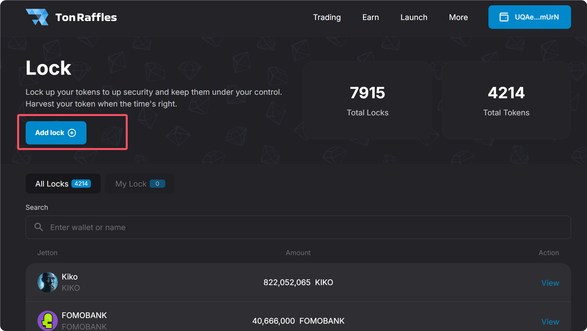

# 6️⃣ TON锁池平台TonRaffles使用教程

## TON锁池操作流程

### 1、连接钱包

访问Tonraffles的官网：[https://tonraffles.app/lock](https://tonraffles.app/lock) ，点击右上角`Connect Wallet`进行钱包连接。

<figure><figcaption></figcaption></figure>

此时会弹出钱包选择页面，安装的是Tonkeeper，就选择Tonkeeper。如果安装的是其他钱包插件，就选择你安装的插件。

<figure><figcaption></figcaption></figure>

<figure><figcaption></figcaption></figure>

钱包连接完成后，右上角会出现你的钱包地址。

<figure><figcaption></figcaption></figure>

### 2、开始锁池/锁仓

点击页面中部位置的`Add lock`。

<figure><figcaption></figcaption></figure>

### 3、填写锁池/锁仓信息

<figure><figcaption></figcaption></figure>

**Token or LP Token Address：**&#x5C31;是你要锁仓/锁池的相关合约地址。

**锁仓：**&#x8F93;入代币合约地址。

**锁池：**&#x8F93;入LP合约地址。

**Lock Fee：**&#x31;47.94个RAFF。这个是锁池的费用，RAFF是他们的平台币，需要支付147.94个。

**Use another owner：**&#x662F;否使用另一个权限地址？如果是，输入的新地址将在解锁后收到代币。

**Title：**&#x4E00;个标签，随便写就行，无关紧要，不写也无所谓。

**Amount：**&#x5982;果是锁仓，就填写要锁仓的代币数量；如果要锁池，就填写LP数量。

**Local Time：**&#x89E3;锁时间。这个时间会默认转换为你的当地时间，不需要做过多改动。

**锁池时间提示：**&#x786E;保你的余额中有指定数量的代币。你需要进行一笔快速交易。创建一个智能合约的价格（不包括 gas 费用）：销毁 5 个 RAFF 代币。

## ❓常见问题 FAQ

### Q: 锁池/锁仓要花钱吗？

**A:** Tonraffles每锁一次，要支付 147.94个RAFF代币。TonInu锁池不需要付费，只需要gas就可以。但为什么依然推荐Tonraffles呢？因为Tonraffles平台较大，稳定性好。

### Q: 锁池/锁仓是必须的吗？

**A:** 这不是一个必须要做的事情。但是从项目运营角度来看，锁仓有利于降低代币的流动率，锁池有利于遏制项目方跑路。

### 🤝 连接 GTokenTool 

* **💬 Telegram社群**：[点击加入官方群组](https://t.me/gtokentool)
* **🐦 Twitter (X)**：[关注我们获取最新动态](https://x.com/gtokentool)
* **📚 官方文档**：[查看 Gitbook 文档](https://docs.gtokentool.com/)
* **💻 开源代码**：[访问 GitHub 仓库](https://github.com/Gtokentool/docs/blob/master/SUMMARY.md)
* **📺 视频教程**：[订阅 YouTube 频道](https://www.youtube.com/@GTokenTool)

> ⚠️ 风险提示与免责声明
>
> GTokenTool 保留随时全权酌情因任何理由修改、变更或取消此公告的权利，无需事先通知。
>
> 以上信息内容仅供参考，GTokenTool 对本平台上的任何虚拟资产、产品或促销活动不做任何推荐或保证。虚拟资产的价格波动很大，投资交易虚拟资产将面临巨大风险。**请谨慎投资。**
