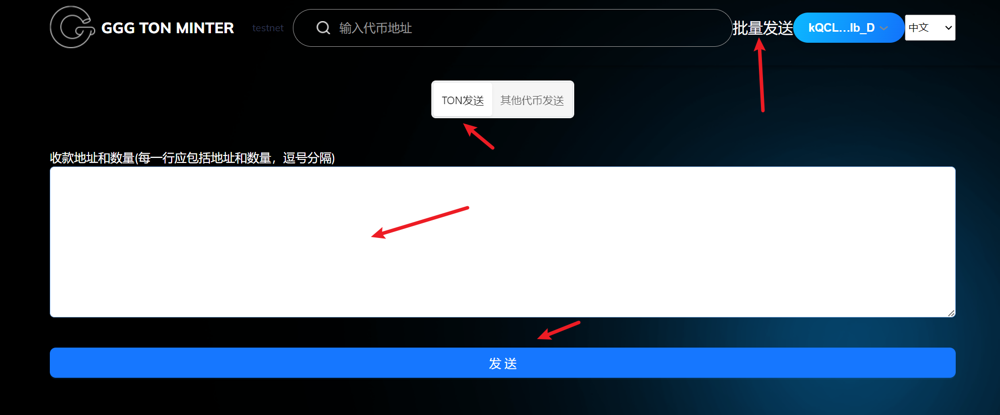

# 4️⃣ TON批量发送代币教程

## TON批量发送代币视频教程



### 1.点击连接钱包

批量发币 [https://ton.gtokentool.com/send](https://ton.gtokentool.com/send)

<figure><figcaption></figcaption></figure>

### 2.填写信息

2.1 选择发送Ton主币，还是其他代币。

2.2 选择发送其他代币，需要输入代币地址。

2.3 填写收款地址和数量（每一行应包括地址和数量，逗号分隔）。

例如 0QCLBoC--JdBVhFdhhH9\_gjnlEi3xzmCAXKyLl1iOvZ5IeIG,10

<figure><figcaption></figcaption></figure>

### 3.点击发送

弹出钱包确认框，点击确认，完成批量发送。

如有不明白或者不清楚的地方，请加入官方电报群：[**https://t.me/gtokentool**](https://t.me/gtokentool)
