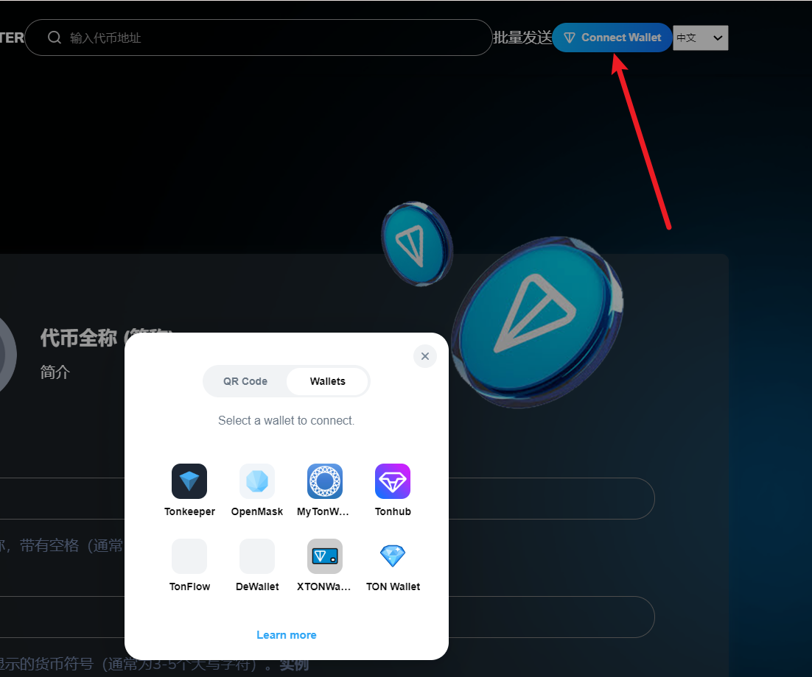
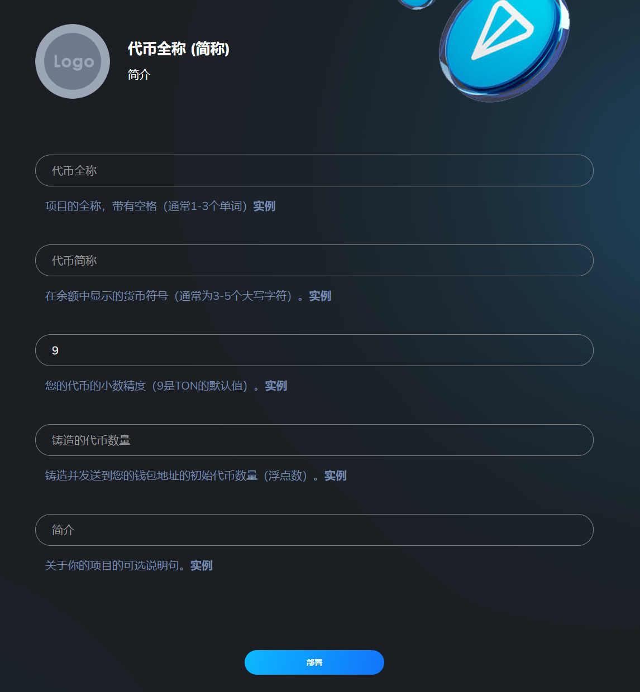
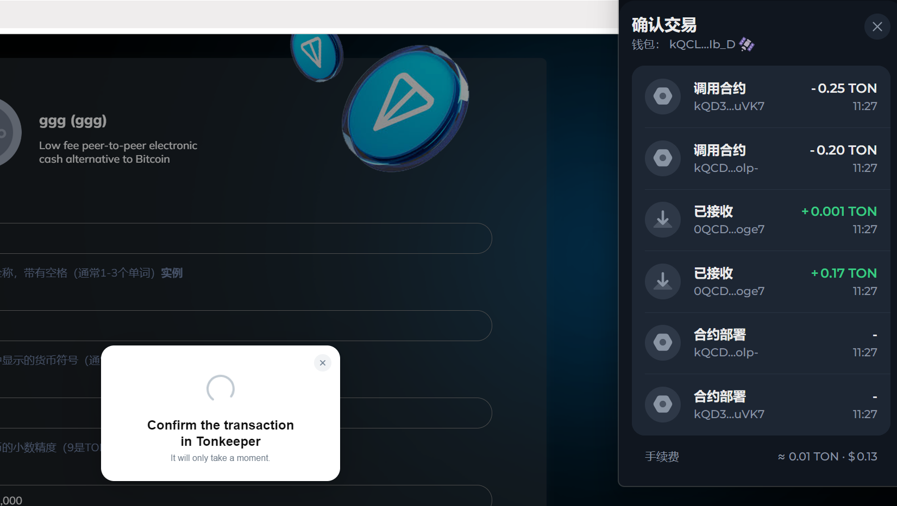

# 3️⃣ TON链一键发币教程

## TON一键发币视频教程



## TON发币流程

### 1.点击连接钱包

发币官网 [https://ton.gtokentool.com](https://ton.gtokentool.com)

<figure><figcaption></figcaption></figure>

### 2.填写代币信息

**Logo：**&#x4EE3;币头像，可在钱包中显示logo代币图片。

**代币名称：**&#x4EE3;币的名称信息（如gggToken），支持英文、中文以及中英文混合，最多15个字符。

**代币简称：**&#x4EE3;币的简称信息（如GGG），支持英文、中文以及中英文混合，最多15个字符。

**代币精度：**&#x4EE3;币的精度位数，默认为9，精度与你能填写的最大总供应量有关。

**总供应量：**&#x4EE3;币的总供应量，当精度为9时，总供应量不能超过100亿；当精度为8时，总供应量不能超过1000亿，以此类推。

**简介：**&#x4EE3;币的简介。

<figure><figcaption></figcaption></figure>

### 3.点击"部署"，创建代币

确认信息之后，点击"确认创建"按钮，之后会跳出钱包提示，点击去"确认"支付费用，即可完成创建。

<figure><figcaption></figcaption></figure>

## 常见问答

### 1、错误提示503是什么意思？

答：这个提示是网络链接太卡，刷新。

### 2、为什么我在Tonkeeper钱包里没有看到代币选项？

答：请先确认自己的地址是否正确。TON地址与比特币类似，有个多个，需要切换到正确的活动地址。

### 3、发币钱包需要准备多个TON？

答：钱包内最少准备10个TON。

如有不明白或者不清楚的地方，请加入官方电报群：[**https://t.me/gtokentool**](https://t.me/gtokentool)
