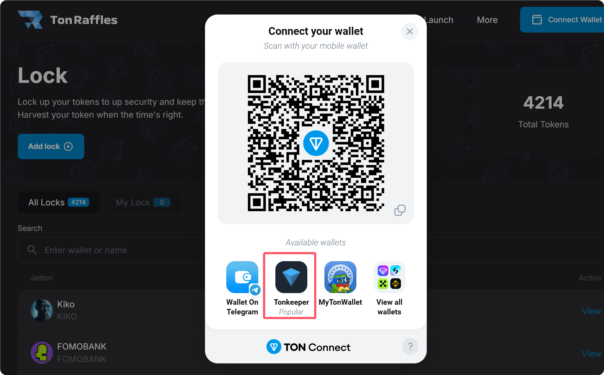
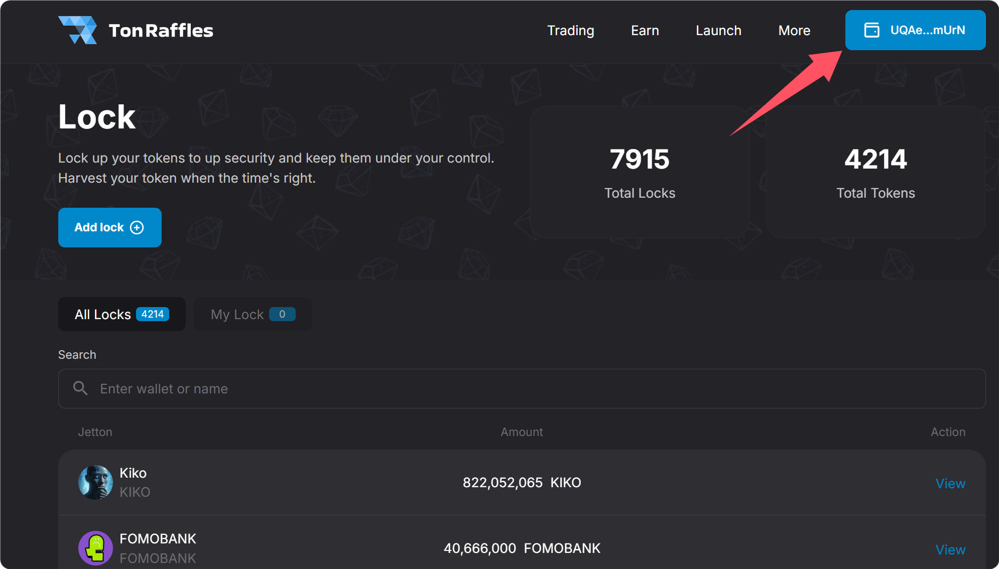
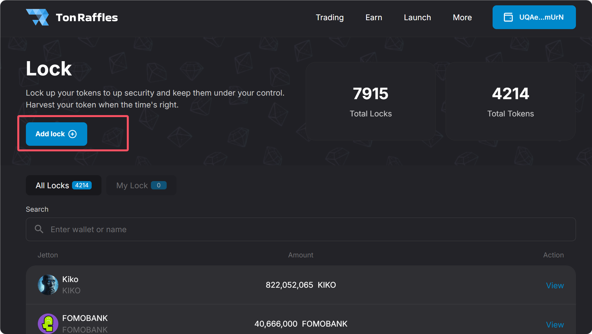
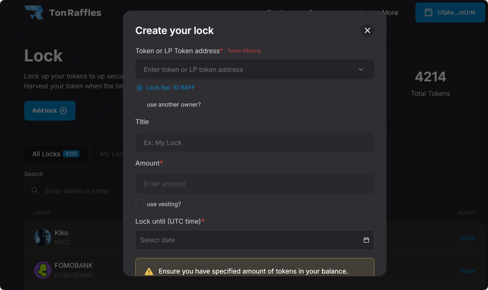

# 6️⃣ TON锁池平台TonRaffles使用教程

## TON锁池操作流程

### 1、连接钱包

访问Tonraffles的官网：[https://tonraffles.app/lock](https://tonraffles.app/lock) ，点击右上角Connect Wallet进行钱包连接。

<figure><figcaption></figcaption></figure>

此时会弹出钱包选择页面，安装的是Tonkeeper，就选择Tonkeeper。如果安装的是其他钱包插件，就选择你安装的插件。

<figure><figcaption></figcaption></figure>

<figure><figcaption></figcaption></figure>

钱包连接完成后，右上角会出现你的钱包地址。

<figure><figcaption></figcaption></figure>

### 2、开始锁池/锁仓

点击页面中部位置的Add lock。

<figure><figcaption></figcaption></figure>

### 3、填写锁池/锁仓信息

<figure><figcaption></figcaption></figure>

**Token or LP Token Address：**&#x5C31;是你要锁仓/锁池的相关合约地址。

**锁仓：**&#x5C31;输入代币合约地址。

**锁池：**&#x5C31;输入LP合约地址。

**Lock Fee：**&#x31;0个RAFF。这个是锁池的费用，RAFF是他们的平台币，需要支付10个。

**Use another owner：**&#x662F;否使另一个权限地址？如果是，输入的新地址将在解锁后收到代币。

**Title：**&#x4E00;个标签，随便写就行，无关紧要，不写也无所谓。

**Amount：**&#x5982;果是锁仓，就填写要锁仓的代币数量；如果要锁池，就填写LP数量。

**Local Time：**&#x89E3;锁时间。这个时间会默认转换为你的当地时间，不需要做过多改动。

**锁池时间提示：**&#x45;nsure you have specified amount of tokens in your balance. You'll need to make one quick transaction. Price of creating one smart contract (excluding gas): burn 10 RAFF tokens.

## 常见问题

### 1. 锁池/锁仓要花钱吗？

答：Tonraffles每锁一次，要支付10个RAFF代币。TonInu锁池不需要付费，只需要gas就可以。但为什么依然推荐Tonraffles呢？因为Tonraffles平台较大，稳定性好。

### 2. 锁池/锁仓是必须的吗？

答：这不是一个必须要做的事情。但是从项目运营角度来看，锁仓有利于降低代币的流动率，锁池有利于遏制项目方跑路。

如有不明白或者不清楚的地方，请加入官方电报群：[https://t.me/gtokentool](https://t.me/gtokentool)
