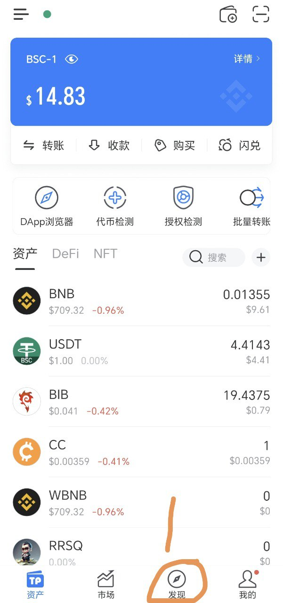
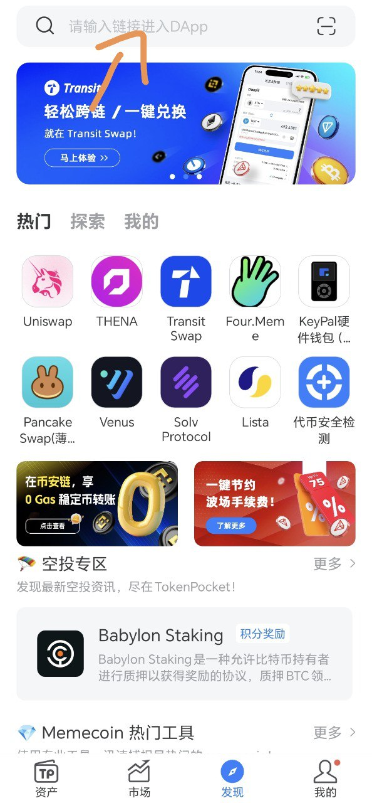
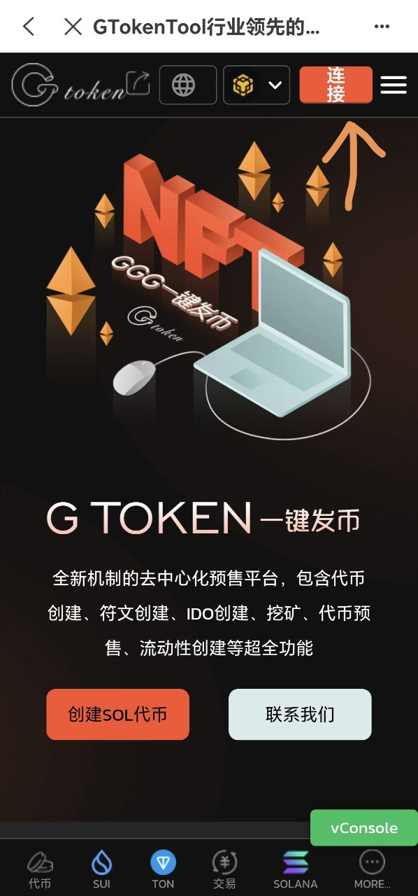
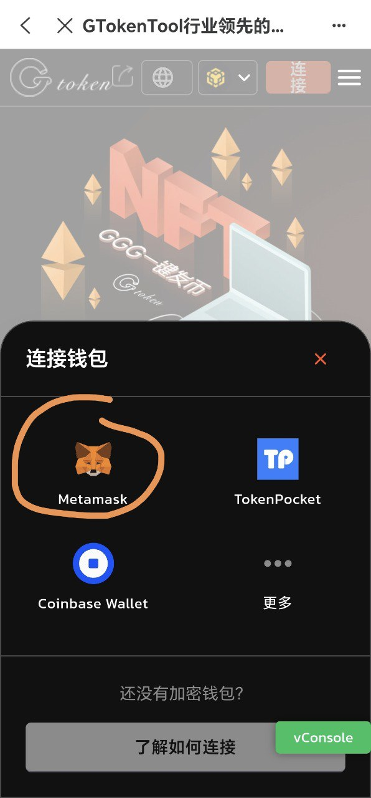

# TP手机发币教程

## 1打开TP钱包（或者欧意web3钱包），切换您要发布的链，点击发现

(1)如果没有TP钱包，可在官网中下载：[https://www.tokenpocket.pro/](https://www.tokenpocket.pro/)

<figure><figcaption></figcaption></figure>

<figure><figcaption></figcaption></figure>

## 2.输入平台官网:[www.gtokentool.com](https://www.gtokentool.com/),打开，点击连接钱包

<figure><figcaption></figcaption></figure>

<figure><figcaption></figcaption></figure>

## 3:点击创建代币模块

如有不明白或者不清楚的地方，请加入官方电报群：[**https://t.me/gtokentool**](https://t.me/gtokentool)
