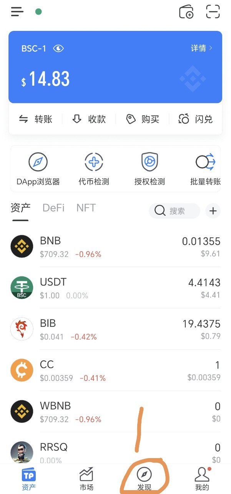
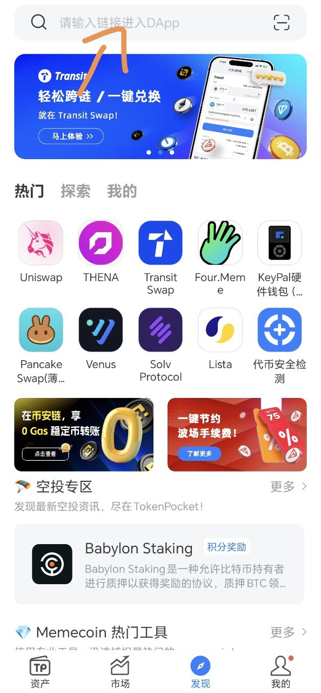
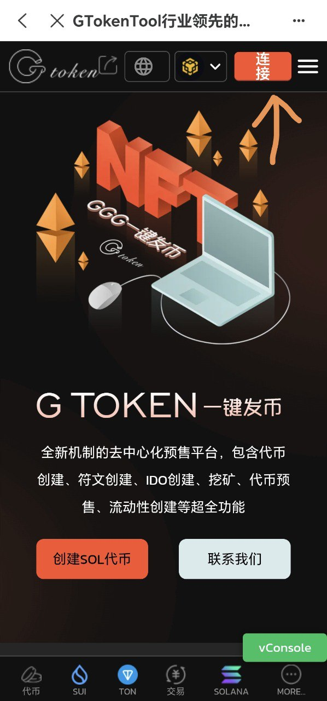
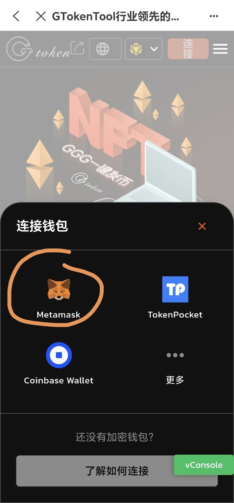

# TP手机发币教程

## 1. 打开TP钱包（或者欧意web3钱包），切换您要发布的链，点击发现

如果没有TP钱包，可在官网中下载：[https://www.tokenpocket.pro/](https://www.tokenpocket.pro/)

<figure><figcaption></figcaption></figure>

<figure><figcaption></figcaption></figure>

## 2. 输入平台官网:[www.gtokentool.com](https://www.gtokentool.com/),打开，点击连接钱包

<figure><figcaption></figcaption></figure>

<figure><figcaption></figcaption></figure>

## 3. 点击创建代币模块

开始创建代币，多种模式可选择。

### 🤝 连接 GTokenTool 

* **💬 Telegram社群**：[点击加入官方群组](https://t.me/gtokentool)
* **🐦 Twitter (X)**：[关注我们获取最新动态](https://x.com/gtokentool)
* **📚 官方文档**：[查看 Gitbook 文档](https://docs.gtokentool.com/)
* **💻 开源代码**：[访问 GitHub 仓库](https://github.com/Gtokentool/docs/blob/master/SUMMARY.md)
* **📺 视频教程**：[订阅 YouTube 频道](https://www.youtube.com/@GTokenTool)

> ⚠️ 风险提示与免责声明
>
> GTokenTool 保留随时全权酌情因任何理由修改、变更或取消此公告的权利，无需事先通知。
>
> 以上信息内容仅供参考，GTokenTool 对本平台上的任何虚拟资产、产品或促销活动不做任何推荐或保证。虚拟资产的价格波动很大，投资交易虚拟资产将面临巨大风险。**请谨慎投资。**
