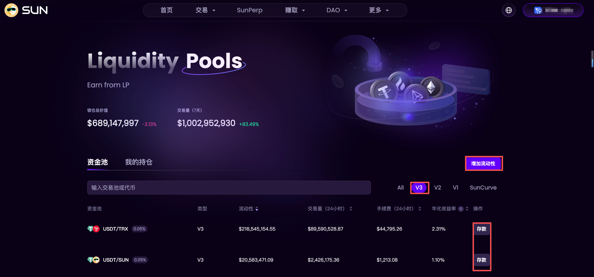
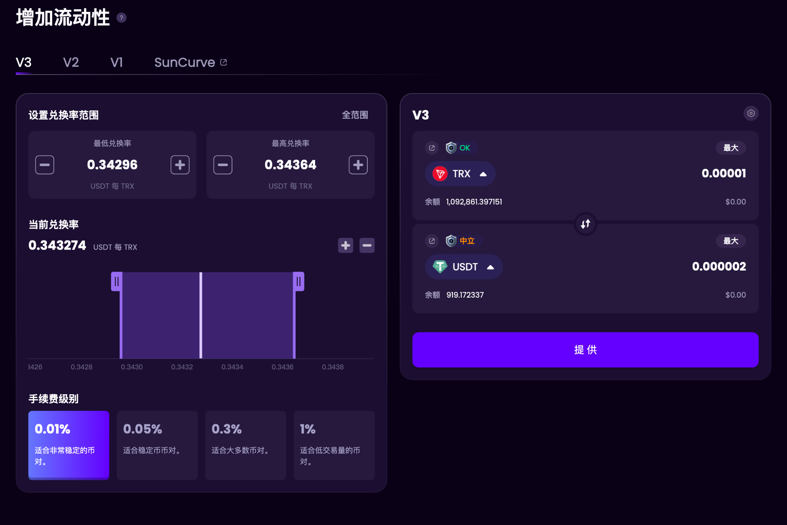
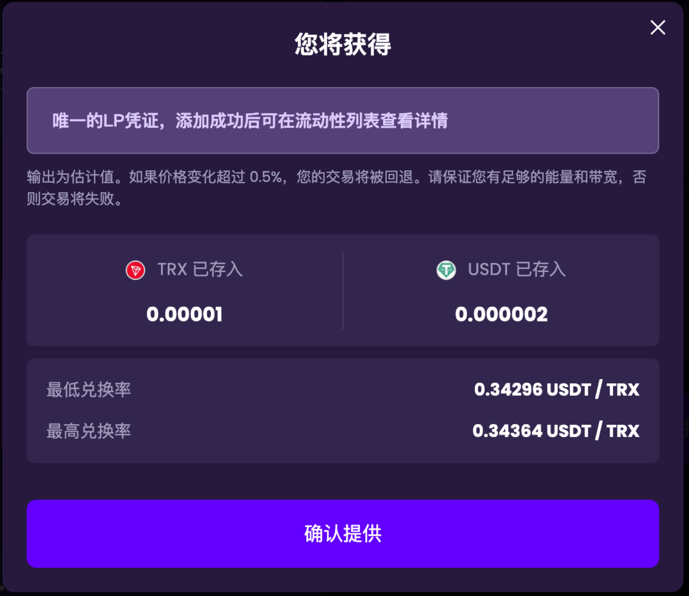
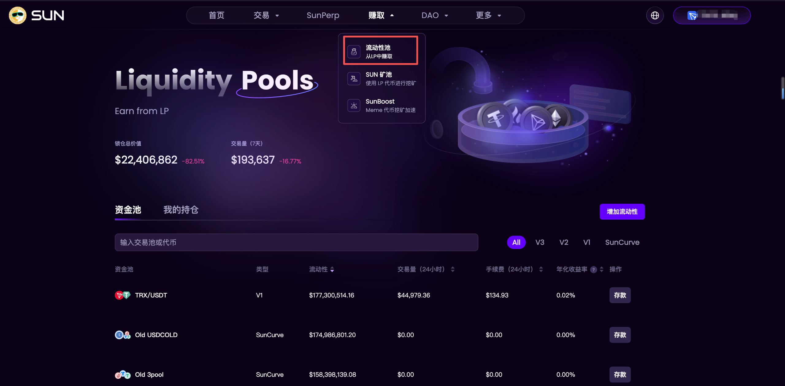
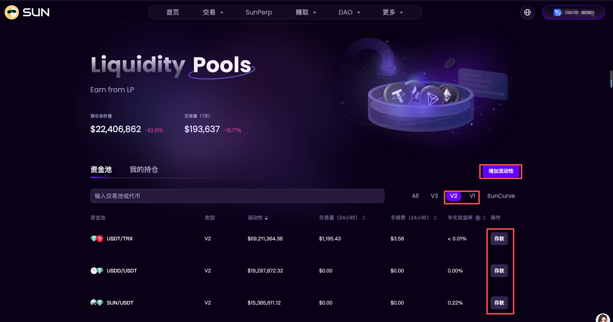
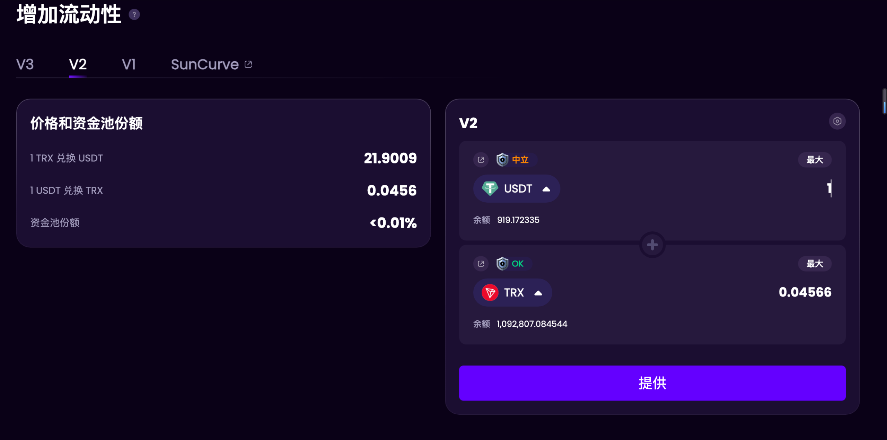
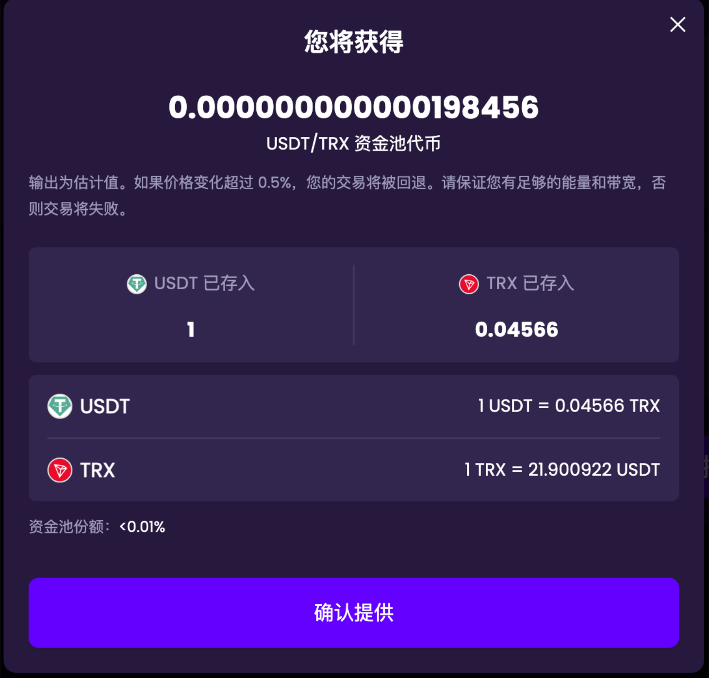
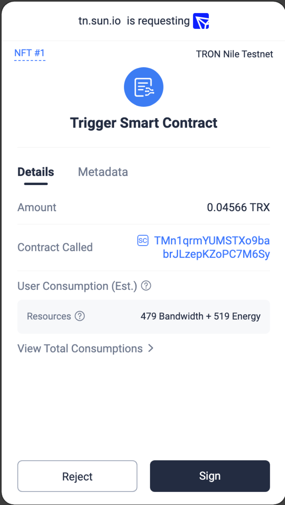
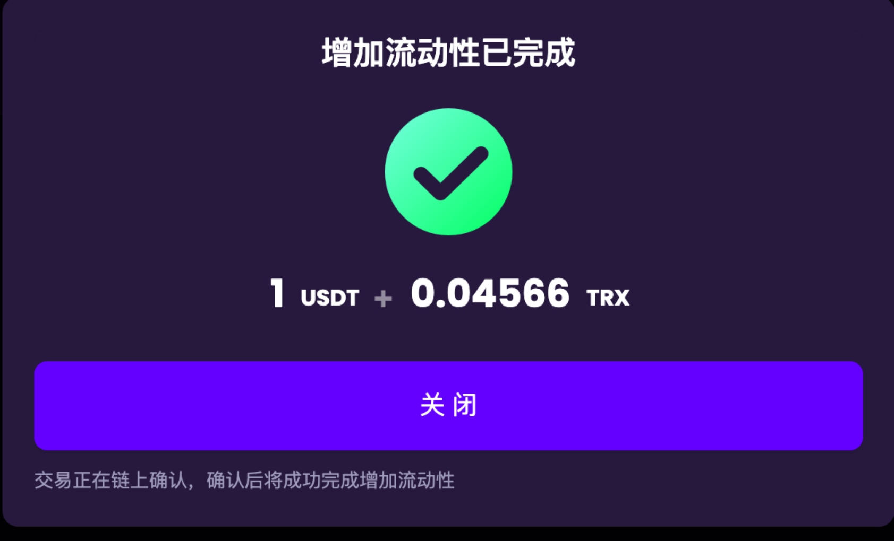

# SUNswap添加流动性教程

官方文档：[https://docs-zh.sun.io/GETSTART/Exchange/LiquidityPool/HowToAddLiquidity](https://docs-zh.sun.io/GETSTART/Exchange/LiquidityPool/HowToAddLiquidity)

### 如何增加流动性？

### V3

1. 点击“赚取”--->"流动性池"进入流动性池页面并选择“V3”，在流动性池页面点击“增加流动性”按钮或者点击资金池列表后面的“存款”按钮。

<figure><figcaption></figcaption></figure>

2. 点击“增加流动性”按钮或者点击资金池列表后面的“存款”按钮，进入增加流动性页面，手续费级别和设置兑换率范围都不可操作，只能输入要增加的代币数量，输入代币数量后点击「提供」按钮。

<figure><figcaption></figcaption></figure>

3. 确认提供且签名后可以完成追加流动性，确认签名后会弹出「增加流动性已完成」弹框。追加流动性成功后在该流动性对应的详情页可以看到已添加的流动性价值和代币数量会更新。

<figure><figcaption></figcaption></figure>

### V1/V2 

1. 点击“赚取”--->"流动性池"进入流动性池页面并选择“V1”或者”V2“，在流动性池页面点击“增加流动性”按钮或者点击资金池列表后面的“存款”按钮。

<figure><figcaption></figcaption></figure>

<figure><figcaption></figcaption></figure>

2. 选择您想要增加流动性的两个token（V1 其中一个必须是TRX），输入数量，点击“提供”按钮。

> 注：平台将根据该资金池的token pair相对价格，对您输入一个token数量计算出所需的另外一个token数量。

<figure><figcaption></figcaption></figure>

3. 在提供流动性确认窗口中，点击“确认提供”按钮。

<figure><figcaption></figcaption></figure>

4. 页面提示添加资金等待您的钱包确认，请在TronLink请求签名弹框中点击“接受”按钮。

<figure><figcaption></figcaption></figure>

5. 弹窗提示添加流动性交易已提交。

<figure><figcaption></figcaption></figure>

6. 几秒后页面右上角提示增加流动性状态为“已确认”后即增加流动性成功。

<figure><figcaption></figcaption></figure>
