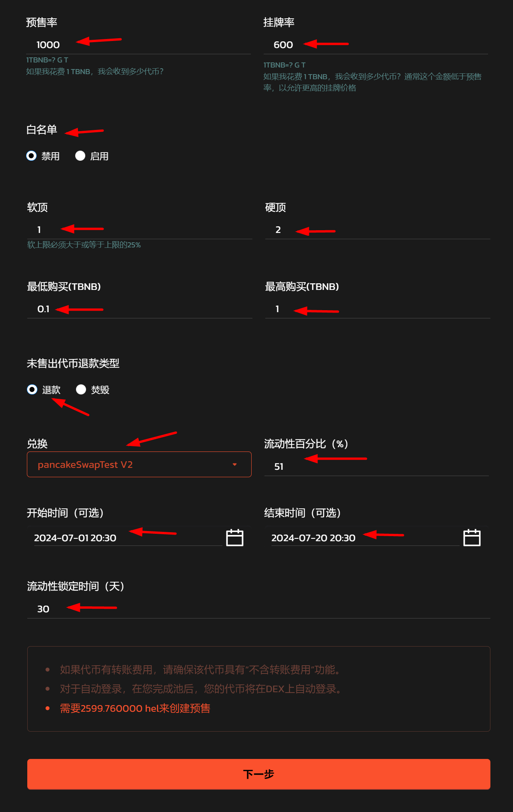
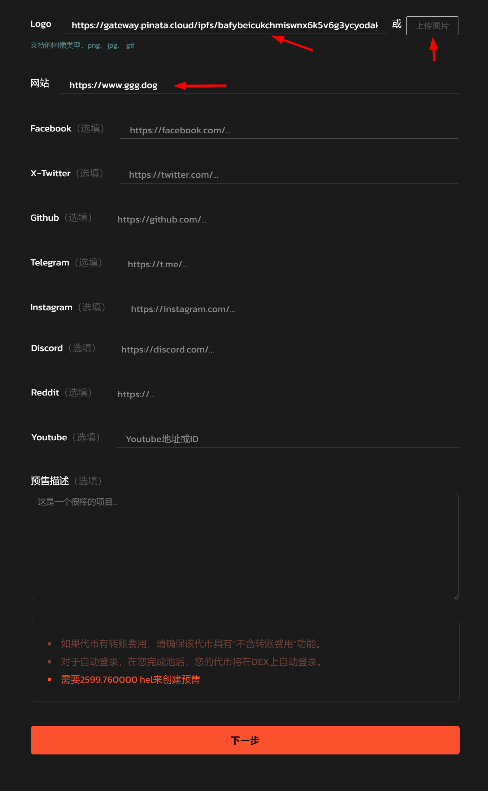
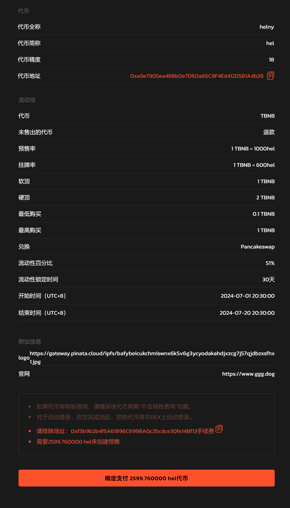
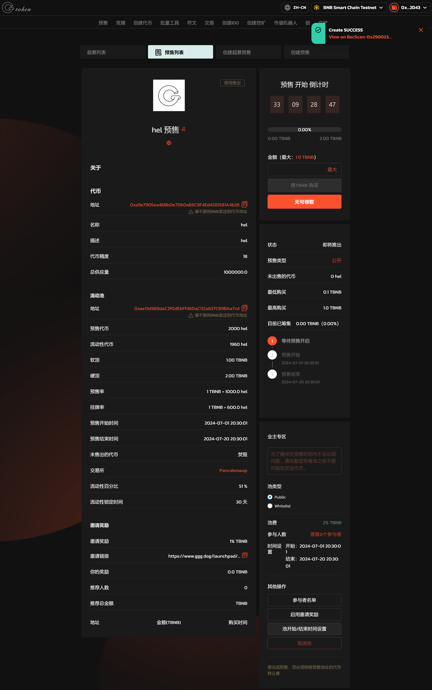

# 1️⃣ 创建普通预售

## 创建普通预售视频教程



提示：请先安装小狐狸钱包插件，教程：[https://docs.gtokentool.com/fu-zhu-xin-xi/metamask-installation](https://docs.gtokentool.com/fu-zhu-xin-xi/metamask-installation)

## 创建普通预售流程

### 第1步，连接钱包 

进入页面：[https://www.gtokentool.com/launchpad/create](https://www.gtokentool.com/launchpad/create)，在右上角，连接网络（这里以BSC测试网为例)，连接小狐狸钱包。

<figure><figcaption></figcaption></figure>

完成后，会看到 “链名称” 和 您的“钱包地址” ，如下图：

<figure><figcaption></figcaption></figure>

### 第2步，输入信息 

代币地址：0xa9e7905ea46Bb0e7D60a66C9F4Ed412D581A4b28

货币：BNB（用户将会使用什么货币支付你的代币）

推荐奖励（选填）%：1

点击“下一步”按钮。

<figure><figcaption></figcaption></figure>

预售率：1000（1TBNB=? G T）

挂牌率：600（1TBNB=? G T，通常这个金额低于预售率，以允许更高的挂牌价格）

白名单：禁用

软顶：1（软上限必须大于或等于上限的25%）

硬顶：2

最低购买(TBNB)：0.1

最高购买(TBNB)：1

未售出代币退款类型：退款

兑换：pancakeSwapTest V2

流动性百分比（%）：51

开始时间（可选）：2024-07-01 20:30

结束时间（可选）：2024-07-20 20:30

流动性锁定时间（天）：30

点击“下一步”按钮。

<figure><figcaption></figcaption></figure>

Logo：https://gateway.pinata.cloud/ipfs/bafybeicukchm...（如果没有图片地址，可以点击右边的“上传图片” 按钮）

网站：[https://www.gtokentool.com](https://www.gtokentool.com)

剩下的联系方式和项目描述，均为选填。

点击“下一步”按钮。

<figure><figcaption></figcaption></figure>

详情预览，确认无误，点击“确定支付”。

<figure><figcaption></figcaption></figure>

### 第3步，完成

在小狐狸钱包上支付Gas费，就完成了。

<figure><figcaption></figcaption></figure>

如有不明白或者不清楚的地方，请加入官方电报群：[https://t.me/gtokentool](https://t.me/gtokentool)
