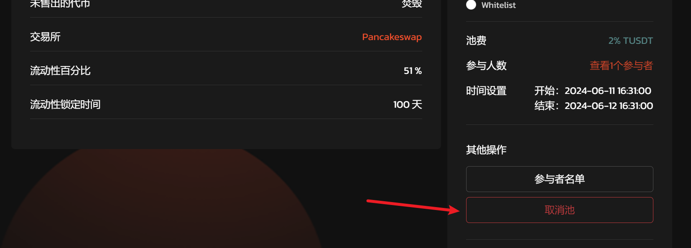
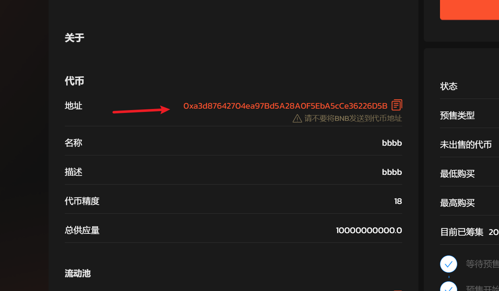

# 5️⃣ 取消预售

## 取消预售流程 

### 第 1 步：取消预售

#### 1. 连接你的钱包。

#### 2. 查看你自己的预售池。

#### 3. 点击所有者专区的“取消矿池”按钮，然后在 MetaMask 上“确认”交易。

<figure><figcaption></figcaption></figure>

### 第 2 步：从已取消的池子中提取代币 

如果您的代币在合同中包含费用、奖励和最大交易，那么您必须排除预售地址中的这些功能才能完成预售池。

#### 1. 在完成预售之前，您需要从[BSCScan](https://bscscan.com/)访问您的合约地址，或者您可以单击启动板页面上的代币地址。

<figure><figcaption></figcaption></figure>

#### 2. 转到合约->编写合约->连接到 Web3 来连接您的钱包，您需要使用所有者地址。

<figure><figcaption></figcaption></figure>

#### 3. Ctrl + F，搜索“exclude”，输入你的预售地址，点击“Write”，为预售地址排除费用、奖励、最大交易。

<figure><figcaption></figcaption></figure>

#### 4. 点击“写入”按钮后，MetaMask 将要求您确认交易。它还会显示您需要为该交易支付的费用。如果您同意，请点击“确认”按钮完成该过程。

如果看到排除（bool），请输入“True”。

<figure><figcaption></figcaption></figure>

_注意：有时合约中没有“排除”而是“豁免”，搜索“豁免”，然后输入您的预售地址，然后点击“写入”以排除预售地址的费用、奖励、最大交易。_

5\. 最后点击“提取已取消的代币”按钮。

<figure><figcaption></figcaption></figure>

如有不明白或者不清楚的地方，请加入官方电报群：[https://t.me/gtokentool](https://t.me/gtokentool)
